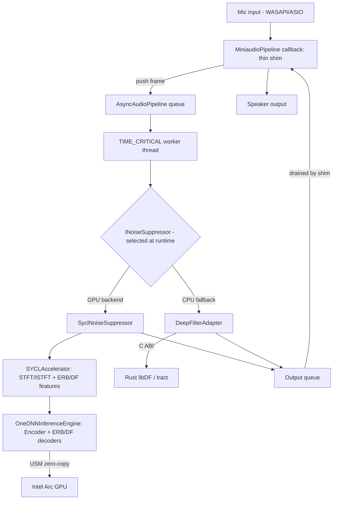

**English** · [Português (Brasil)](./README.pt-BR.md)

# SilenceArc


A native C++20 real-time noise-suppression engine that runs the DeepFilterNet3 speech-enhancement model directly on Intel Arc GPUs via SYCL and oneDNN, with no OpenVINO or ONNX Runtime in the path.

## Contents

- [What it is](#what-it-is)
- [Why it exists](#why-it-exists)
- [Architecture](#architecture)
- [Quickstart](#quickstart)
- [Verified results](#verified-results)
- [Testing](#testing)
- [Project layout](#project-layout)
- [Known limitations](#known-limitations)
- [Roadmap](#roadmap)
- [Documentation](#documentation)
- [Contributing](#contributing)
- [License](#license)
- [Author](#author)

## What it is

SilenceArc is a Windows desktop application that captures microphone audio via WASAPI/ASIO, runs it through the DeepFilterNet3 neural noise-suppression model, and plays back the cleaned signal — with a Dear ImGui interface showing live GPU utilization, processing latency, and signal levels.

Two interchangeable backends implement the same domain interface (`INoiseSuppressor`), selected at runtime:

- **GPU path** (`SyclNoiseSuppressor`): STFT/ISTFT, ERB/DF feature extraction, and the DeepFilterNet3 encoder/decoders run as SYCL kernels and oneDNN primitives directly on Intel Arc hardware, using Unified Shared Memory for zero-copy buffers.
- **CPU fallback** (`DeepFilterAdapter`): calls into a vendored, locally-modified build of [Rikorose's DeepFilterNet](https://github.com/Rikorose/DeepFilterNet) Rust workspace (`tract`/ONNX inference) through a C ABI.

## Why it exists

Most consumer noise-suppression tools reach the GPU through a generic inference runtime (OpenVINO, ONNX Runtime, DirectML). SilenceArc instead writes the inference and DSP path directly against SYCL and oneDNN. The motivation is architectural control, not a claim that this is the only way to do it: owning the SYCL queue lets custom kernels for STFT/ISTFT and TNC↔NCHW tensor-layout permutation be interleaved with oneDNN's neural primitives without extra host round-trips, which oneDNN's own GPU `reorder` primitive cannot do efficiently for the layouts DeepFilterNet3 needs. The full reasoning is in [docs/en/PHILOSOPHY.md](./docs/en/PHILOSOPHY.md) and [docs/en/adr/001-model-selection.md](./docs/en/adr/001-model-selection.md).

## Architecture

Clean Architecture, two tiers (see [ADR-002](./docs/en/adr/002-two-tier-noise-suppression-abstraction.md) for the full rationale):

- **Tier 1** — the domain seam: `INoiseSuppressor`, implemented by `SyclNoiseSuppressor` (GPU) and `DeepFilterAdapter` (CPU), chosen at runtime in `main.cpp`.
- **Tier 2** — private to the GPU backend: DSP (`SYCLAccelerator`) is split from neural inference (`OneDNNInferenceEngine`), both driven off a single in-order USM SYCL queue.

A dedicated `THREAD_PRIORITY_TIME_CRITICAL` worker (`AsyncAudioPipeline`) runs `INoiseSuppressor::ProcessFrame` off the WASAPI audio callback, using bounded drop-oldest queues so heavy GPU/NN work never blocks the real-time thread.



More detail: [docs/en/ARCHITECTURE.md](./docs/en/ARCHITECTURE.md) (full data-flow diagram) and [docs/en/ENGINE.md](./docs/en/ENGINE.md) (weight mapping, memory layouts, USM).

## Quickstart

These steps are exactly what `docs/en/SETUP.md` documents; nothing here is aspirational.

**Prerequisites**

- An Intel Arc GPU (Alchemist/A-series or Battlemage/B-series).
- [Intel oneAPI Base Toolkit](https://www.intel.com/content/www/us/en/developer/tools/oneapi/base-toolkit.html) 2024.0+, for the `icx` compiler, oneDNN, and oneMKL.
- CMake 3.20+ and Ninja.
- The [Level Zero SDK](https://github.com/oneapi-src/level-zero) — `CMakeLists.txt` searches `C:/Program Files/LevelZeroSDK/*` by default and fails the configure step with a `FATAL_ERROR` if it isn't found; point `SILENCE_ARC_LEVEL_ZERO_ROOT` at your install if it's elsewhere.
- Rust, only if you intend to modify the vendored DeepFilterNet core and rebuild `df.dll` yourself.

**Build**

```bash
git clone https://github.com/FellypeMelo/SilenceArc.git
cd SilenceArc

# Initialize the oneAPI environment (compiler, oneDNN, oneMKL on PATH)
.\setup_intel.bat

mkdir build
cd build
cmake -G "Ninja" -DCMAKE_CXX_COMPILER=icx -DCMAKE_C_COMPILER=icx ..
cmake --build . --config Release
```

`CMakeLists.txt` copies the committed `df.dll` next to the build output automatically as a post-build step of the `silence_arc_infra` target — see [Known limitations](#known-limitations) below for why that binary is committed at all.

**Run**

```bash
cd ..
.\run.bat
```

`run.bat` looks for `build/silence_arc.exe` and launches it, or prints an error asking you to build first.

**Verify the GPU path**

```bash
.\build\test_nn_layers.exe
```

This loads the 133 exported DeepFilterNet3 weight tensors and runs one inference pass on your Arc GPU; a successful run prints `[INFO] SYCL Initialized on: Intel(R) Arc(TM) ...`.

## Verified results

Two claims are directly checkable in this repository and were verified against the checked-out source, not taken from documentation:

- **133 weight tensors.** `models/df3_weights/` contains exactly 133 `.bin` tensor files plus `metadata.json`, matching the DeepFilterNet3 encoder/ERB-decoder/DF-decoder topology described in [docs/en/ENGINE.md](./docs/en/ENGINE.md).
- **14 registered tests.** `CMakeLists.txt` registers exactly 14 `add_test()` entries — 7 built on GoogleTest (fetched via CMake `FetchContent`) and 7 as small custom executables with no test framework. Three of those seven (`SYCLDiscoveryTest`, `GPUBridgeTest`, `KernelCorrectnessTest`) share a bespoke header-only assertion harness, `tests/sycl_test_harness.h`; the other four (`BenchmarkHarnessTest`, `UIManagerTest`, `NNLayersTest`, `PipelineLatencyBench`) are plain `assert`/`iostream` mains. See [Testing](#testing).

**What is *not* claimed here:** no latency figure (single-digit millisecond, sub-4ms, or otherwise), no dB noise-reduction figure, and no MOS (Mean Opinion Score) comparison is backed by a committed benchmark result in this repository. `tests/bench_pipeline_latency.cpp` exists and computes real p50/p99 latency against a 10ms budget, but its output has not been committed anywhere. Where such numbers appear in `docs/en/adr/001-model-selection.md` or `docs/en/WHITEPAPER.md`, treat them as figures carried over from the DeepFilterNet3 research literature or as design targets, not as first-party measurements of this codebase.

## Testing

```bash
cd build
ctest --output-on-failure
```

The 14 tests cover the UI manager, the async audio pipeline, the audio stream buffer, telemetry, noise suppression, two end-to-end pipeline tests (loopback and sample-file based), GPU/CPU backend parity, SYCL device discovery, the GPU FFI bridge, SYCL-kernel-vs-baseline correctness (MSE < 1e-13), NN-layer load/inference, and the pipeline-latency benchmark itself.

Most of the SYCL/GPU-path tests require a physical Intel Arc GPU to run; they are not designed to be meaningful on CPU-only or non-Intel hardware. **There is no CI workflow for this project.** No `.github/workflows` directory exists anywhere in the SilenceArc-owned tree — the only GitHub Actions workflows present in the repository belong to the vendored, upstream `DeepFilterNet/.github/`, which builds and tests the upstream Rust/Python project, not SilenceArc. Every test above runs locally, on demand, on Arc-equipped hardware.

## Project layout

```
├── docs/                 # Bilingual docs: docs/en/ (English, source of truth) + docs/pt-BR/ (Português)
├── include/silence_arc/
│   ├── domain/           # INoiseSuppressor and other technology-agnostic contracts
│   └── infrastructure/   # SYCL, oneDNN, miniaudio implementations
├── src/                  # Implementation files (main.cpp, infrastructure/*)
├── models/df3_weights/   # 133 exported DeepFilterNet3 weight tensors + metadata
├── scripts/              # export_df3_weights.py and other build/export tooling
├── tests/                # The 14 CTest-registered executables + sample audio
├── DeepFilterNet/        # Vendored (not a git submodule), locally-modified Rikorose/DeepFilterNet
└── third_party/          # Vendored miniaudio.h; imgui is FetchContent-vendored, not committed here
```

`conductor/` (task-tracking specs and plans) and `gemini.md` (an AI-agent operating manual, in Portuguese) are internal engineering-process artifacts from how this project was built, not user- or contributor-facing documentation. They're left in place as-is.

## Known limitations

- **`df.dll` / `df.dll.lib` are committed binaries** (≈18.7 MB) at the repository root, not just build output. The build system copies them into `build/` automatically (see Quickstart), so a fresh clone builds and runs without a Rust toolchain — but committing a prebuilt binary is a repository-hygiene issue, not a design goal. Rebuilding it from `DeepFilterNet/` requires Rust and is the intended path if you modify the model logic.
- **No tagged releases.** `git tag` is empty and `CMakeLists.txt` does not set a project version.
- **No hosted CI.** See [Testing](#testing).
- **Alpha maturity.** GPU-path correctness has been validated by the test suite above on the author's hardware; it has not been through the kind of multi-device, multi-driver validation a production release would need.

## Roadmap

Phases 1 and 2 of the SYCL/oneDNN port are complete: a build environment with a working SYCL toolchain, a lightweight test harness for GPU code (replacing GTest where GTest doesn't fit), and STFT/ISTFT/deep-filtering DSP kernels validated against a numerical baseline.

Phase 3 (GPU neural-network porting) is open:

- Map the remaining DeepFilterNet3 layers (convolutions, GRU/linear) to oneDNN primitives beyond what's already implemented.
- Finish porting the ERB and DF decoders to run entirely on GPU.
- Validate full GPU inference against the Rust/`tract` CPU baseline.
- Optimize data flow and batching once correctness is established.

See [docs/en/ROADMAP.md](./docs/en/ROADMAP.md) for the task-by-task history behind this summary, including a correction to a stale file reference carried over from an earlier internal tracker.

## Documentation

[docs/README.md](./docs/README.md) is the bilingual documentation index (English/`docs/en/` and Português/`docs/pt-BR/`, same filenames and structure in both). Direct links to the English tree:

- [docs/en/ARCHITECTURE.md](./docs/en/ARCHITECTURE.md) — system architecture and data-flow diagram
- [docs/en/ENGINE.md](./docs/en/ENGINE.md) — SYCL/oneDNN inference engine internals
- [docs/en/PHILOSOPHY.md](./docs/en/PHILOSOPHY.md) — design rationale for bypassing OpenVINO/ONNX Runtime
- [docs/en/SETUP.md](./docs/en/SETUP.md) — full build & environment setup
- [docs/en/USAGE.md](./docs/en/USAGE.md) — end-user guide
- [docs/en/ROADMAP.md](./docs/en/ROADMAP.md) — phase-by-phase engineering roadmap
- [docs/en/adr/001-model-selection.md](./docs/en/adr/001-model-selection.md) — ADR: DeepFilterNet3 vs RNNoise
- [docs/en/adr/002-two-tier-noise-suppression-abstraction.md](./docs/en/adr/002-two-tier-noise-suppression-abstraction.md) — ADR: the two-tier backend abstraction
- [docs/en/WHITEPAPER.md](./docs/en/WHITEPAPER.md) — project whitepaper

## Contributing

See [CONTRIBUTING.md](./CONTRIBUTING.md) for build prerequisites, the test workflow, and pull request expectations. Please also read [CODE_OF_CONDUCT.md](./CODE_OF_CONDUCT.md). To report a security issue, see [SECURITY.md](./SECURITY.md) rather than opening a public issue.

## License

SilenceArc itself is licensed under the [Apache License 2.0](./LICENSE).

The vendored `DeepFilterNet/` workspace (Rikorose/DeepFilterNet, locally modified) carries its own upstream licensing — `DeepFilterNet/LICENSE-APACHE` and `DeepFilterNet/LICENSE-MIT` — and its own upstream documentation, CI, and tooling config, none of which is altered here. `third_party/miniaudio/miniaudio.h` is vendored under its own dual Public Domain / MIT-No-Attribution license, stated in the file itself.

## Author

**Fellype Melo** — [github.com/FellypeMelo](https://github.com/FellypeMelo)
