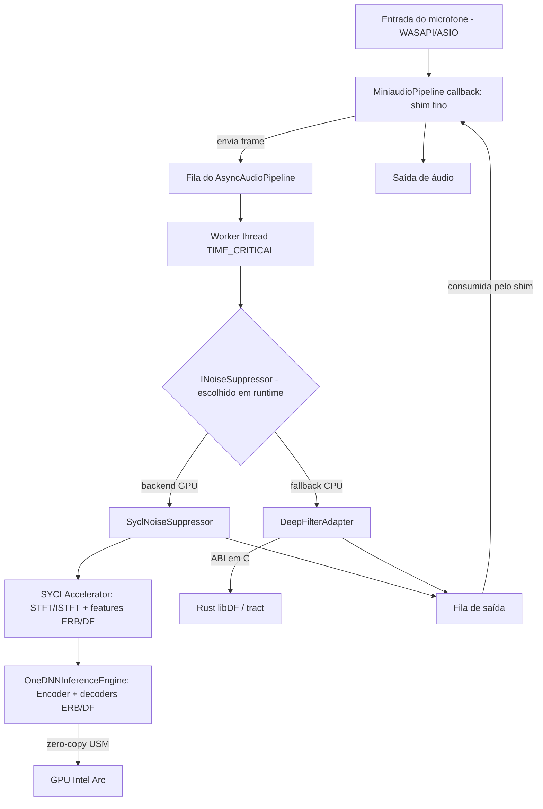

[English](./README.md) · **Português (Brasil)**

# SilenceArc


Um engine nativo em C++20 de supressão de ruído em tempo real que executa o modelo de aprimoramento de voz DeepFilterNet3 diretamente em GPUs Intel Arc via SYCL e oneDNN, sem passar por OpenVINO ou ONNX Runtime.

## Sumário

- [O que é](#o-que-é)
- [Por que existe](#por-que-existe)
- [Arquitetura](#arquitetura)
- [Início rápido](#início-rápido)
- [Resultados verificados](#resultados-verificados)
- [Testes](#testes)
- [Estrutura do projeto](#estrutura-do-projeto)
- [Limitações conhecidas](#limitações-conhecidas)
- [Roadmap](#roadmap)
- [Documentação](#documentação)
- [Contribuindo](#contribuindo)
- [Licença](#licença)
- [Autor](#autor)

## O que é

SilenceArc é uma aplicação desktop para Windows que captura áudio do microfone via WASAPI/ASIO, processa o sinal através do modelo de supressão de ruído neural DeepFilterNet3 e reproduz o áudio já tratado — com uma interface em Dear ImGui exibindo, em tempo real, utilização da GPU, latência de processamento e níveis de sinal.

Dois backends intercambiáveis implementam a mesma interface de domínio (`INoiseSuppressor`), escolhida em tempo de execução:

- **Caminho GPU** (`SyclNoiseSuppressor`): STFT/ISTFT, extração de features ERB/DF e o encoder/decoders do DeepFilterNet3 rodam como kernels SYCL e primitivas oneDNN diretamente no hardware Intel Arc, usando Unified Shared Memory para buffers zero-copy.
- **Fallback de CPU** (`DeepFilterAdapter`): chama uma build vendorizada e localmente modificada do workspace Rust do [DeepFilterNet de Rikorose](https://github.com/Rikorose/DeepFilterNet) (inferência `tract`/ONNX) através de uma ABI em C.

## Por que existe

A maioria das ferramentas de supressão de ruído para consumidor final chega à GPU por meio de um runtime de inferência genérico (OpenVINO, ONNX Runtime, DirectML). O SilenceArc, em vez disso, escreve o caminho de inferência e DSP diretamente contra SYCL e oneDNN. A motivação é controle arquitetural, não a afirmação de que essa seja a única forma de fazer isso: possuir a fila SYCL permite intercalar kernels customizados de STFT/ISTFT e permutação de layout de tensor TNC↔NCHW com as primitivas neurais do oneDNN sem idas e vindas extras ao host — algo que a própria primitiva `reorder` de GPU do oneDNN não faz de forma eficiente para os layouts que o DeepFilterNet3 exige. O raciocínio completo está em [docs/en/PHILOSOPHY.md](./docs/en/PHILOSOPHY.md) e [docs/en/adr/001-model-selection.md](./docs/en/adr/001-model-selection.md), com equivalentes em português em [docs/pt-BR/PHILOSOPHY.md](./docs/pt-BR/PHILOSOPHY.md) e [docs/pt-BR/adr/001-model-selection.md](./docs/pt-BR/adr/001-model-selection.md).

## Arquitetura

Clean Architecture, em duas camadas (ver [ADR-002](./docs/pt-BR/adr/002-two-tier-noise-suppression-abstraction.md) para a justificativa completa, também disponível em [inglês](./docs/en/adr/002-two-tier-noise-suppression-abstraction.md)):

- **Camada 1** — a costura de domínio: `INoiseSuppressor`, implementada por `SyclNoiseSuppressor` (GPU) e `DeepFilterAdapter` (CPU), escolhida em tempo de execução em `main.cpp`.
- **Camada 2** — privada ao backend de GPU: o DSP (`SYCLAccelerator`) é separado da inferência neural (`OneDNNInferenceEngine`), ambos operando sobre uma única fila SYCL USM in-order.

Uma worker thread dedicada com `THREAD_PRIORITY_TIME_CRITICAL` (`AsyncAudioPipeline`) executa `INoiseSuppressor::ProcessFrame` fora do callback de áudio do WASAPI, usando filas limitadas com descarte do frame mais antigo, de forma que o trabalho pesado de GPU/rede neural nunca bloqueie a thread de tempo real.



Mais detalhes: [docs/pt-BR/ARCHITECTURE.md](./docs/pt-BR/ARCHITECTURE.md) (diagrama completo de fluxo de dados) e [docs/pt-BR/ENGINE.md](./docs/pt-BR/ENGINE.md) (mapeamento de pesos, layouts de memória, USM) — com os originais em inglês em [docs/en/ARCHITECTURE.md](./docs/en/ARCHITECTURE.md) e [docs/en/ENGINE.md](./docs/en/ENGINE.md).

## Início rápido

Estes passos reproduzem exatamente o que está documentado em `docs/pt-BR/SETUP.md` (`docs/en/SETUP.md` em inglês); nada aqui é aspiracional.

**Pré-requisitos**

- Uma GPU Intel Arc (Alchemist/série A ou Battlemage/série B).
- [Intel oneAPI Base Toolkit](https://www.intel.com/content/www/us/en/developer/tools/oneapi/base-toolkit.html) 2024.0+, para o compilador `icx`, oneDNN e oneMKL.
- CMake 3.20+ e Ninja.
- O [Level Zero SDK](https://github.com/oneapi-src/level-zero) — o `CMakeLists.txt` procura por padrão em `C:/Program Files/LevelZeroSDK/*` e falha a etapa de configure com `FATAL_ERROR` caso não encontre; aponte `SILENCE_ARC_LEVEL_ZERO_ROOT` para sua instalação se ela estiver em outro lugar.
- Rust, apenas se você pretende modificar o core vendorizado do DeepFilterNet e recompilar o `df.dll` você mesmo.

**Build**

```bash
git clone https://github.com/FellypeMelo/SilenceArc.git
cd SilenceArc

# Inicializa o ambiente oneAPI (compilador, oneDNN, oneMKL no PATH)
.\setup_intel.bat

mkdir build
cd build
cmake -G "Ninja" -DCMAKE_CXX_COMPILER=icx -DCMAKE_C_COMPILER=icx ..
cmake --build . --config Release
```

O `CMakeLists.txt` copia automaticamente o `df.dll` já commitado para junto do resultado do build, como passo pós-build do target `silence_arc_infra` — veja [Limitações conhecidas](#limitações-conhecidas) abaixo para entender por que esse binário está commitado.

**Executar**

```bash
cd ..
.\run.bat
```

O `run.bat` procura por `build/silence_arc.exe` e o inicia, ou imprime um erro pedindo para compilar primeiro.

**Verificar o caminho de GPU**

```bash
.\build\test_nn_layers.exe
```

Isso carrega os 133 tensores de pesos exportados do DeepFilterNet3 e executa um ciclo de inferência na sua GPU Arc; uma execução bem-sucedida imprime `[INFO] SYCL Initialized on: Intel(R) Arc(TM) ...`.

## Resultados verificados

Duas afirmações são diretamente verificáveis neste repositório e foram checadas contra o código-fonte, não copiadas da documentação:

- **133 tensores de pesos.** `models/df3_weights/` contém exatamente 133 arquivos `.bin` de tensores mais `metadata.json`, correspondendo à topologia encoder/decoder-ERB/decoder-DF do DeepFilterNet3 descrita em [docs/pt-BR/ENGINE.md](./docs/pt-BR/ENGINE.md).
- **14 testes registrados.** O `CMakeLists.txt` registra exatamente 14 entradas `add_test()` — 7 construídas sobre GoogleTest (obtido via `FetchContent` do CMake) e 7 como pequenos executáveis próprios, sem framework de testes. Três desses sete (`SYCLDiscoveryTest`, `GPUBridgeTest`, `KernelCorrectnessTest`) compartilham um harness de asserções próprio, header-only (`tests/sycl_test_harness.h`); os outros quatro (`BenchmarkHarnessTest`, `UIManagerTest`, `NNLayersTest`, `PipelineLatencyBench`) são mains simples com `assert`/`iostream`. Veja [Testes](#testes).

**O que *não* está sendo afirmado aqui:** nenhum número de latência (milissegundos de um dígito, sub-4ms ou qualquer outro), nenhuma redução em dB e nenhuma comparação de MOS (Mean Opinion Score) está lastreada por um resultado de benchmark commitado neste repositório. O arquivo `tests/bench_pipeline_latency.cpp` existe e calcula p50/p99 reais de latência contra um orçamento de 10ms, mas sua saída nunca foi commitada. Onde esses números aparecem em `docs/pt-BR/adr/001-model-selection.md` ou em `docs/pt-BR/WHITEPAPER.md`, trate-os como valores herdados da literatura de pesquisa do DeepFilterNet3 ou como metas de projeto — nunca como medições de primeira mão deste código.

## Testes

```bash
cd build
ctest --output-on-failure
```

Os 14 testes cobrem o gerenciador de UI, o pipeline assíncrono de áudio, o buffer de stream de áudio, telemetria, supressão de ruído, dois testes end-to-end (loopback e baseados em arquivos de amostra), paridade entre os backends GPU/CPU, descoberta de dispositivo SYCL, a ponte FFI de GPU, corretude de kernel SYCL contra uma baseline numérica (MSE < 1e-13), carregamento/inferência das camadas de rede neural, e o próprio benchmark de latência do pipeline.

A maior parte dos testes do caminho SYCL/GPU exige uma GPU Intel Arc física para rodar; eles não foram pensados para fazer sentido em hardware apenas de CPU ou de outro fabricante. **Não existe workflow de CI para este projeto.** Não há diretório `.github/workflows` em nenhum lugar da árvore própria do SilenceArc — os únicos workflows do GitHub Actions presentes no repositório pertencem ao `DeepFilterNet/.github/`, vendorizado do projeto upstream, que builda e testa o projeto Rust/Python original, não o SilenceArc. Todos os testes acima rodam localmente, sob demanda, em hardware equipado com Arc.

## Estrutura do projeto

```
├── docs/                 # Docs bilíngues: docs/en/ (inglês, fonte da verdade) + docs/pt-BR/ (Português)
├── include/silence_arc/
│   ├── domain/           # INoiseSuppressor e outros contratos agnósticos de tecnologia
│   └── infrastructure/   # Implementações SYCL, oneDNN, miniaudio
├── src/                  # Arquivos de implementação (main.cpp, infrastructure/*)
├── models/df3_weights/   # 133 tensores de pesos exportados do DeepFilterNet3 + metadata
├── scripts/              # export_df3_weights.py e outras ferramentas de build/export
├── tests/                # Os 14 executáveis registrados no CTest + áudio de amostra
├── DeepFilterNet/        # Vendorizado (não é git submodule), modificado localmente a partir do Rikorose/DeepFilterNet
└── third_party/          # miniaudio.h vendorizado; imgui é vendorizado via FetchContent, não commitado aqui
```

`conductor/` (specs e planos de acompanhamento de tarefas) e `gemini.md` (um manual operacional de agente de IA, em português) são artefatos internos do processo de engenharia usado na construção deste projeto, não documentação voltada a usuários ou contribuidores. Ambos permanecem no repositório como estão.

## Limitações conhecidas

- **`df.dll` / `df.dll.lib` são binários commitados** (≈18,7 MB) na raiz do repositório, não apenas saída de build. O sistema de build os copia automaticamente para `build/` (ver Início rápido), então um clone novo compila e roda sem precisar de toolchain Rust — mas commitar um binário pré-compilado é um problema de higiene de repositório, não um objetivo de design. Recompilá-lo a partir de `DeepFilterNet/` exige Rust e é o caminho pretendido caso você modifique a lógica do modelo.
- **Sem releases marcadas.** `git tag` está vazio e o `CMakeLists.txt` não define uma versão de projeto.
- **Sem CI hospedada.** Veja [Testes](#testes).
- **Maturidade alfa.** A corretude do caminho de GPU foi validada pela suíte de testes acima no hardware do autor; ainda não passou pelo tipo de validação multi-dispositivo e multi-driver que uma versão de produção exigiria.

## Roadmap

As Fases 1 e 2 da portabilidade para SYCL/oneDNN estão concluídas: um ambiente de build com toolchain SYCL funcional, um harness de testes leve para código de GPU (substituindo o GTest onde ele não se encaixa) e kernels de DSP para STFT/ISTFT e deep filtering validados contra uma baseline numérica.

A Fase 3 (portabilidade da rede neural para GPU) está em aberto:

- Mapear as camadas restantes do DeepFilterNet3 (convoluções, GRU/linear) para primitivas oneDNN além do que já está implementado.
- Terminar a portabilidade dos decoders ERB e DF para rodar inteiramente na GPU.
- Validar a inferência completa em GPU contra a baseline de CPU em Rust/`tract`.
- Otimizar o fluxo de dados e o batching depois que a corretude estiver estabelecida.

Veja [docs/pt-BR/ROADMAP.md](./docs/pt-BR/ROADMAP.md) para o histórico tarefa a tarefa por trás deste resumo, incluindo a correção de uma referência de arquivo desatualizada herdada de um rastreador interno anterior.

## Documentação

[docs/README.md](./docs/README.md) é o índice bilíngue da documentação (inglês em `docs/en/` e português em `docs/pt-BR/`, com os mesmos nomes de arquivo e a mesma estrutura nas duas árvores). Links diretos para a árvore em português:

- [docs/pt-BR/ARCHITECTURE.md](./docs/pt-BR/ARCHITECTURE.md) — arquitetura do sistema e diagrama de fluxo de dados
- [docs/pt-BR/ENGINE.md](./docs/pt-BR/ENGINE.md) — internals do engine de inferência SYCL/oneDNN
- [docs/pt-BR/PHILOSOPHY.md](./docs/pt-BR/PHILOSOPHY.md) — racional de design para não depender de OpenVINO/ONNX Runtime
- [docs/pt-BR/SETUP.md](./docs/pt-BR/SETUP.md) — guia completo de build e configuração de ambiente
- [docs/pt-BR/USAGE.md](./docs/pt-BR/USAGE.md) — guia do usuário final
- [docs/pt-BR/ROADMAP.md](./docs/pt-BR/ROADMAP.md) — roadmap de engenharia, fase a fase
- [docs/pt-BR/adr/001-model-selection.md](./docs/pt-BR/adr/001-model-selection.md) — ADR: DeepFilterNet3 vs RNNoise
- [docs/pt-BR/adr/002-two-tier-noise-suppression-abstraction.md](./docs/pt-BR/adr/002-two-tier-noise-suppression-abstraction.md) — ADR: a abstração de backend em duas camadas
- [docs/pt-BR/WHITEPAPER.md](./docs/pt-BR/WHITEPAPER.md) — whitepaper do projeto

## Contribuindo

Veja [CONTRIBUTING.md](./CONTRIBUTING.md) (em inglês) para pré-requisitos de build, o fluxo de testes e expectativas de pull request. Leia também o [CODE_OF_CONDUCT.md](./CODE_OF_CONDUCT.md). Para reportar uma vulnerabilidade de segurança, veja [SECURITY.md](./SECURITY.md) em vez de abrir uma issue pública.

## Licença

O SilenceArc em si é licenciado sob a [Apache License 2.0](./LICENSE).

O workspace vendorizado `DeepFilterNet/` (Rikorose/DeepFilterNet, modificado localmente) carrega seu próprio licenciamento upstream — `DeepFilterNet/LICENSE-APACHE` e `DeepFilterNet/LICENSE-MIT` — além de sua própria documentação, CI e configuração de ferramentas upstream, nada disso alterado aqui. `third_party/miniaudio/miniaudio.h` é vendorizado sob sua própria licença dupla Public Domain / MIT-No-Attribution, declarada no próprio arquivo.

## Autor

**Fellype Melo** — [github.com/FellypeMelo](https://github.com/FellypeMelo)
