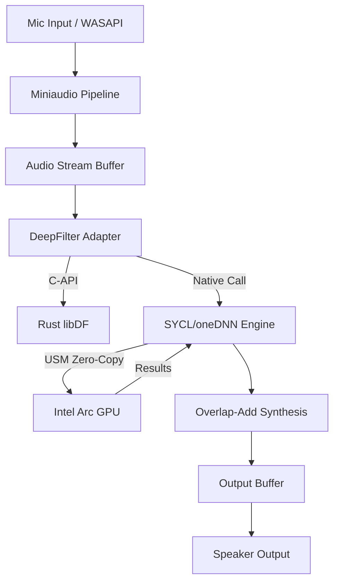

# SilenceArc: Technical Architecture

SilenceArc follows a modular, layer-based architecture designed for high-performance audio processing and low-latency GPU inference.

## System Overview

The application is divided into three primary technological domains:
1.  **C++ Host (Infrastructure & UI):** Manages Windows Audio APIs (WASAPI/ASIO), the GUI (Dear ImGui), and the implementation of the SYCL/oneDNN engine.
2.  **Rust Core (DeepFilterNet):** Provides the perceptual model logic and weight management.
3.  **SYCL/oneAPI Backend (GPU):** Executes the heavy neural network computations on the Intel Arc hardware.

## Layered Architecture

Following **Clean Architecture** principles, the code is organized into distinct layers:

### 1. Domain Layer (`include/silence_arc/domain/`)
-   **Neural Network Interface:** Defines the abstract contracts for inference.
-   **Audio Buffers:** Manages the circular buffers and frame-based audio streams.
-   **GPU Accelerator Base:** An abstract interface for hardware acceleration (allowing CPU fallbacks).

### 2. Infrastructure Layer (`src/infrastructure/`)
-   **Miniaudio Pipeline:** Handles the real-time audio callback loop.
-   **DeepFilter Adapter:** The C-API bridge between the C++ host and the Rust model.
-   **SYCL Accelerator:** The concrete implementation of the GPU interface using the oneAPI stack.
-   **oneDNN Engine:** The core inference runner that maps model topology to GPU primitives.

### 3. Presentation Layer (`src/main.cpp` & `ui_manager.cpp`)
-   **UI Manager:** Handles the ImGui rendering and user interaction state.
-   **Telemetry:** Visualizes real-time GPU utilization, latency, and signal levels.

## Data Flow & Interop

## Bridging C++ and SYCL
SilenceArc utilizes **Unified Shared Memory (USM)** to eliminate data copying overhead between the C++ application and the GPU. The `SYCLAccelerator` manages the device queue and memory allocations, providing a seamless execution context for the `OneDNNInferenceEngine`.
