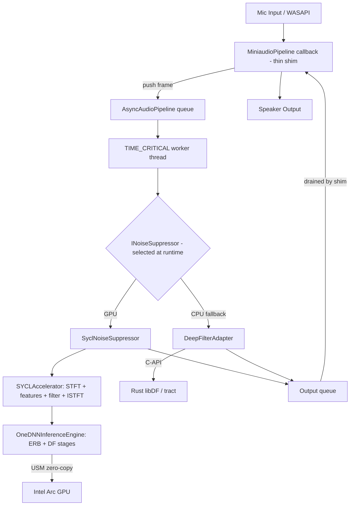

# SilenceArc: Technical Architecture

SilenceArc follows a modular, layer-based architecture designed for high-performance audio processing and low-latency GPU inference.

## System Overview

The application is divided into three primary technological domains:
1.  **C++ Host (Infrastructure & UI):** Manages Windows Audio APIs (WASAPI), the GUI (Dear ImGui), and the native SYCL/oneDNN engine.
2.  **Rust Core (DeepFilterNet):** The CPU fallback — `tract`/ONNX inference plus weight management, exposed to the host through a C API.
3.  **SYCL/oneAPI Backend (GPU):** Executes the STFT, feature extraction, neural network, and deep filtering on Intel Arc hardware.

## Layered Architecture

Following **Clean Architecture** principles, the code is organized into distinct layers. Dependencies point inward: infrastructure depends on domain, never the reverse.

### 1. Domain Layer (`include/silence_arc/domain/`)
The domain holds only technology-agnostic contracts and value types — no SYCL, oneDNN, or WASAPI headers appear here.
-   **`INoiseSuppressor` (`noise_suppressor.h`):** The single backend-selection seam. Both the GPU and CPU engines implement it; `main.cpp` picks one at runtime.
-   **`IAudioPipeline` (`audio_pipeline.h`):** Abstract capture→process→playback pipeline contract.
-   **`ITelemetryProvider` (`telemetry_provider.h`):** Latency/utilization/signal-level readout contract.
-   **`AudioStreamBuffer`:** Lock-light circular buffer for frame-based audio streams.
-   **`AudioMetrics`:** dB-reduction / RMSE helpers used by the parity and E2E tests.
-   **`UIState`:** Plain cross-thread UI state (enable flag, attenuation limit, device selection).

### 2. Infrastructure Layer (`src/infrastructure/`, `include/silence_arc/infrastructure/`)
Two concrete `INoiseSuppressor` implementations, plus the device and threading plumbing:
-   **`SyclNoiseSuppressor`:** GPU backend. Delegates to the SYCL-internal engine below.
-   **`DeepFilterAdapter`:** CPU fallback. The C-API bridge to the Rust `libDF` (`tract`/ONNX) model.
-   **`MiniaudioPipeline`:** Owns the real-time WASAPI duplex device and its audio callback.
-   **`AsyncAudioPipeline`:** Runs `INoiseSuppressor::ProcessFrame()` on a dedicated
    `THREAD_PRIORITY_TIME_CRITICAL` worker with bounded, drop-oldest queues, so the
    heavy GPU/NN work never blocks the real-time audio callback thread.
-   **SYCL-internal Bridge (private to `SyclNoiseSuppressor`, NOT a backend seam):**
    -   **`GPUAccelerator` / `SYCLAccelerator`:** the DSP half — STFT, ERB/DF feature
        extraction, deep filtering, and ISTFT via oneMKL + SYCL kernels on a single
        in-order USM queue.
    -   **`NeuralNetworkModel` / `OneDNNInferenceEngine`:** the NN half — maps the
        DeepFilterNet3 topology (ERB stage + DF stage) onto oneDNN primitives.

### 3. Presentation Layer (`src/main.cpp` & `ui_manager.cpp`)
-   **UI Manager:** Dear ImGui rendering and user-interaction state.
-   **Telemetry:** Visualizes real-time latency, GPU utilization, and signal levels.

## Data Flow & Interop

The WASAPI callback is a thin, non-blocking shim: it frames the input, hands whole
frames to the async worker, and drains finished frames back to the device. All heavy
processing happens off the audio thread.

```mermaid
graph TD
    A[Mic Input / WASAPI] --> B[MiniaudioPipeline callback - thin shim]
    B -- push frame --> C[AsyncAudioPipeline queue]
    C --> D[TIME_CRITICAL worker thread]
    D --> E{INoiseSuppressor - selected at runtime}
    E -- GPU --> F[SyclNoiseSuppressor]
    E -- CPU fallback --> G[DeepFilterAdapter]
    F --> H[SYCLAccelerator: STFT + features + filter + ISTFT]
    H --> I[OneDNNInferenceEngine: ERB + DF stages]
    I -- USM zero-copy --> J[Intel Arc GPU]
    G -- C-API --> K[Rust libDF / tract]
    F --> L[Output queue]
    G --> L
    L -- drained by shim --> B
    B --> M[Speaker Output]
```

## Bridging C++ and SYCL
SilenceArc uses **Unified Shared Memory (USM)** to eliminate host↔device copy overhead.
`SYCLAccelerator` owns a single **in-order** SYCL queue, so kernels auto-chain device-side
and the hot path collapses to essentially one terminal host sync before the mandatory
output copy — see ADR-002 for the two-tier abstraction that keeps this SYCL/oneDNN code
isolated from the domain seam.
