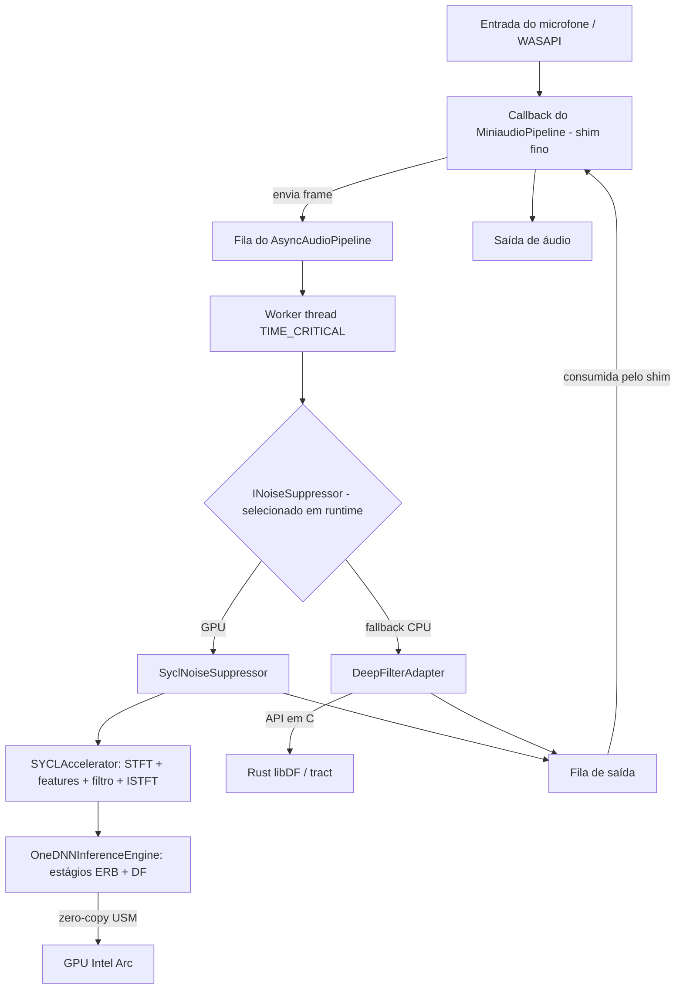

# SilenceArc: Arquitetura Técnica

O SilenceArc segue uma arquitetura modular, em camadas, projetada para processamento de áudio de alto desempenho e inferência de GPU de baixa latência.

## Visão Geral do Sistema

A aplicação é dividida em três domínios tecnológicos principais:
1.  **Host em C++ (Infraestrutura e UI):** Gerencia as APIs de áudio do Windows (WASAPI), a GUI (Dear ImGui) e o engine nativo SYCL/oneDNN.
2.  **Core em Rust (DeepFilterNet):** O fallback de CPU — inferência `tract`/ONNX mais gerenciamento de pesos, exposto ao host através de uma API em C.
3.  **Backend SYCL/oneAPI (GPU):** Executa o STFT, a extração de features, a rede neural e o deep filtering no hardware Intel Arc.

## Arquitetura em Camadas

Seguindo os princípios de **Clean Architecture**, o código é organizado em camadas distintas. As dependências apontam para dentro: infraestrutura depende de domínio, nunca o contrário.

### 1. Camada de Domínio (`include/silence_arc/domain/`)
O domínio contém apenas contratos e tipos de valor agnósticos de tecnologia — nenhum header de SYCL, oneDNN ou WASAPI aparece aqui.
-   **`INoiseSuppressor` (`noise_suppressor.h`):** A única costura de seleção de backend. Tanto o engine de GPU quanto o de CPU a implementam; `main.cpp` escolhe um em tempo de execução.
-   **`IAudioPipeline` (`audio_pipeline.h`):** Contrato abstrato do pipeline captura→processamento→reprodução.
-   **`ITelemetryProvider` (`telemetry_provider.h`):** Contrato de leitura de latência/utilização/nível de sinal.
-   **`AudioStreamBuffer`:** Buffer circular com baixo uso de locks para streams de áudio baseados em frames.
-   **`AudioMetrics`:** Helpers de redução em dB / RMSE usados pelos testes de paridade e E2E.
-   **`UIState`:** Estado de UI simples, compartilhado entre threads (flag de habilitação, limite de atenuação, seleção de dispositivo).

### 2. Camada de Infraestrutura (`src/infrastructure/`, `include/silence_arc/infrastructure/`)
Duas implementações concretas de `INoiseSuppressor`, além da plumbing de dispositivo e threading:
-   **`SyclNoiseSuppressor`:** Backend de GPU. Delega para o engine interno SYCL descrito abaixo.
-   **`DeepFilterAdapter`:** Fallback de CPU. A ponte via API em C para o modelo Rust `libDF` (`tract`/ONNX).
-   **`MiniaudioPipeline`:** Controla o dispositivo duplex WASAPI de tempo real e seu callback de áudio.
-   **`AsyncAudioPipeline`:** Executa `INoiseSuppressor::ProcessFrame()` em uma worker thread dedicada
    com `THREAD_PRIORITY_TIME_CRITICAL` e filas limitadas com descarte do frame mais antigo, de forma que
    o trabalho pesado de GPU/rede neural nunca bloqueie a thread de áudio em tempo real.
-   **Bridge interna do SYCL (privada a `SyclNoiseSuppressor`, NÃO é uma costura de backend):**
    -   **`GPUAccelerator` / `SYCLAccelerator`:** a metade de DSP — STFT, extração de
        features ERB/DF, deep filtering e ISTFT via oneMKL + kernels SYCL em uma única
        fila USM in-order.
    -   **`NeuralNetworkModel` / `OneDNNInferenceEngine`:** a metade de rede neural — mapeia a
        topologia do DeepFilterNet3 (estágio ERB + estágio DF) para primitivas oneDNN.

### 3. Camada de Apresentação (`src/main.cpp` e `ui_manager.cpp`)
-   **UI Manager:** Renderização em Dear ImGui e estado de interação do usuário.
-   **Telemetria:** Visualiza latência em tempo real, utilização de GPU e níveis de sinal.

## Fluxo de Dados e Interop

O callback do WASAPI é um shim fino e não-bloqueante: ele enquadra a entrada, entrega
frames completos ao worker assíncrono e drena os frames finalizados de volta ao
dispositivo. Todo o processamento pesado acontece fora da thread de áudio.

## Interoperação entre C++ e SYCL
O SilenceArc usa **Unified Shared Memory (USM)** para eliminar o overhead de cópia entre host e device.
`SYCLAccelerator` possui uma única fila SYCL **in-order**, de forma que os kernels se encadeiam
automaticamente no lado do device e o caminho crítico se reduz a essencialmente uma
sincronização terminal com o host antes da cópia obrigatória de saída — veja a ADR-002
para a abstração em duas camadas que mantém esse código SYCL/oneDNN isolado da
costura de domínio.
